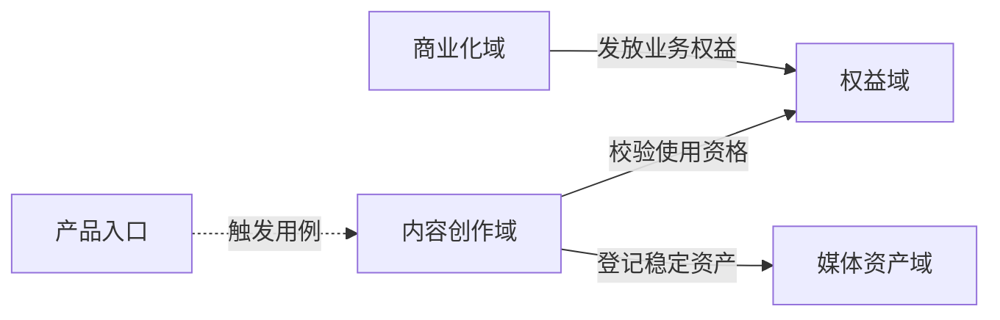

# Modulith 业务领域地图与依赖图

领域建设至少区分业务领域图、上下文协作图和运行架构图。三者可以互相引用，不能为了“一张图看全”而混成同一套节点。

## 三类图的职责

| 图 | 回答什么 | 应包含 | 不应包含 |
|---|---|---|---|
| 业务领域地图 / DAG | 有哪些业务域，稳定依赖方向是什么 | 业务域、限界上下文、业务能力依赖 | 进程、Worker、MQ、对象存储、供应商、DAO |
| 上下文协作图 | 领域之间通过什么契约协作 | API、命令、查询、领域事件、适配器、上下游关系 | 部署副本、Pod、线程、磁盘 |
| 运行架构图 | 系统怎样执行、部署和观测 | 应用、Task Manager、Worker、MQ、缓存、存储、供应商、网络和运行链路 | 把技术节点重新命名成业务域 |

产品、APP、后台和内部调用方可放在业务领域图外作为调用入口，但不能据此直接分类业务域。

## 业务领域目录

先完成目录，再画图：

| 领域 / 上下文 | 业务目标 | 公开能力 | 规则 / 状态 | 数据所有权 | 依赖 | 不纳入范围 |
|---|---|---|---|---|---|---|
| 示例领域 | 稳定业务结果 | 能力簇 | 核心不变量 | 主记录 / 流水 | 目标领域 | 外部执行和技术细节 |

“基础域、核心域、支撑域”等战略分类只能作为补充标签，不能替代边界说明。业务上独立的基础能力应以自己的业务名称出现，不能统一藏进 `foundation`。

## DAG 约定

- 默认箭头表示“调用方 / 消费方依赖能力拥有方”，即 `消费方 --> 能力拥有方`。
- 每条边使用业务动词标注，例如“查询权益”“提交履约”“领取媒体快照”，不写模糊的“依赖”“调用”。
- 事件流使用不同线型并明确“发布事件”与“订阅事件”，不要和同步依赖混淆。
- 图中节点使用业务名称，不使用 `XxxService`、表名、接口路径或供应商名称。
- DAG 必须无环。若两个领域互相协作，不能为了画成 DAG 而隐藏事实；应在上下文协作图中表达双向事件/契约，并继续检查代码依赖能否保持单向。
- 一个大域内部若包含多个可独立演进的上下文，应展开核心子图，不能只画一个总框。

最小示例：

这里的 `product` 是图外调用方，不是领域分类节点。模型执行、Worker 和对象存储不进入这张图。

## 上下文协作

为每条跨域关系定义：

| 消费领域 | 提供领域 | 能力 / 事件 | 同步或异步 | 输入输出语义 | 一致性与失败责任 | 兼容策略 |
|---|---|---|---|---|---|---|
| A | B | 业务能力 | API / Event | 稳定领域对象 | 超时、幂等、补偿归属 | 版本 / 适配器 |

裁决规则：

- 能力接口由提供方定义并实现，消费方只依赖公开契约。
- 外部协议和历史数据格式由靠近来源的一侧适配，不把来源方内部模型泄漏给接收领域。
- 同步调用用于必须即时得到结果的业务约束；异步事件用于已经发生的事实通知，不用事件掩盖强一致要求。
- 跨域流程若拥有独立目标、状态、时限和补偿责任，可评估为流程域；否则编排归属于最接近业务目标的领域。
- 双方共享一张表、互调 Dao 或传递 Entity，表示边界尚未真正建立。

## 域外对象清单

从业务图移除的内容不能丢失，需路由到正确真相源：

| 对象 | 类型 | 与业务域的契约 | 应进入的文档 |
|---|---|---|---|
| Worker / 任务平台 | 外部执行者 | 通用任务与回调协议 | API / 运行架构 / Ops |
| MQ / 调度器 | 运行机制 | 事件投递、重试、时序 | 运行架构 / Ops |
| 对象存储 / 缓存 | 基础设施 | 存储、生命周期、容灾 | 运行架构 / Ops |
| 模型 / 算法 / 供应商 | 外部系统 | 防腐层后的稳定契约 | API / 运行架构 |
| Action / Controller | 入口适配 | 调用领域公开能力 | 工程结构 / API |

## 术语映射

交付图时必须附表，避免同一名称同时指产品、领域、模块和数据对象：

| 图中名称 | 类型 | 准确定义 | 代码映射 | 易混淆对象 |
|---|---|---|---|---|
| 示例 | 业务域 / 上下文 / 调用方 | 一句话定义 | 当前 / 目标包 | 不等于什么 |

对于“作品、任务、资产、模板、权益、额度、缓存、生产”等高歧义词，要明确原始产物、稳定领域对象和业务投影是否为不同概念。

## 图的验收

- 每个节点都能在领域目录中找到边界说明。
- 每条边都能在协作表中找到能力拥有方和失败责任。
- 没有把产品入口、运行时执行者、基础设施或技术分层误标为业务域。
- 没有因为“共享”而把多个具有独立业务语义的能力压成大域。
- 战略分类、限界上下文和代码模块三个层次没有混用。
- 图、术语表、公开能力和数据所有权相互一致。
