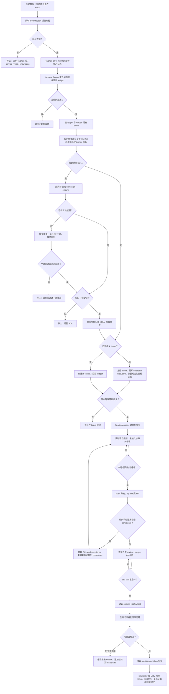

# WMXS Incident Loop

## 定位

这是 WMXS 生产异常的手动闭环编排技能。它只负责顺序、门禁和交接，不替代底层技能：

- 查 Taishan 日志时使用 `taishan-log-query`。
- 需要查询 Taishan 应用信息时使用 `taishan-app-info`。
- 通过 Taishan 查询 SQL 是应用排查取证的一部分；需要受控 SQL 查询、SQL 查询申请、SQL 执行记录时使用 `taishan-app-info` 的 SQL 能力。
- 进入具体仓库修复时使用 `codex-workflow`，并先读仓库 `AGENTS.md` / `CLAUDE.md` 与项目知识库。
- 排查根因时使用 `superpowers:systematic-debugging`。
- 涉及跨工程、需求边界、高风险确认时使用 `lead`。

默认只在用户手动触发时执行，不创建 automation，不做后台轮询。

## 项目映射

先读取当前工作区的项目注册表：

```text
.agent-state/wmxs-agent/projects.json
```

项目 key 必须能映射到：

- `taishanAppId`
- `service`
- `defaultEnv`
- `repo`
- `knowledge`
- GitLab 目标分支策略，默认 test MR 目标为 `test`
- 可选 `taishanSql`，用于记录 Taishan SQL 查询默认环境、数据库索引、审批策略和行数上限

如果项目不在映射中，先让用户补齐，不猜 Taishan ID 或本地目录。

## 应用排查取证

应用问题排查优先按最小侵入方式形成证据链，Taishan SQL 是其中的一等取证入口：

1. 业务日志：生产 error / warning / server 日志。
2. 访问日志：按 host、path、method、status、trace 标识查请求链路。
3. Taishan 应用信息：部署、域名、资源、K8S、数据库连接概览；敏感值只输出结构性摘要。
4. GitLab 上下文：现有 Issue、MR、commit、review comments。
5. Taishan SQL：用于确认业务数据状态、任务状态、配置状态、幂等记录、近期 SQL 变更等排查证据。
   - `SQL执行记录查看`：查看已有 SQL 执行记录和 SQL 内容，不能据此自动执行。
   - `SQL查询申请`：无查询权限时先发起或提示发起申请，审批未通过前停止。
   - `受控SQL查询`：用于只读诊断查询。

当前 Taishan 日志查询已有稳定命令；SQL 查询申请、申请列表、受控 SQL 初始化、只读查询、结果获取和关闭会话也已在 `taishan-app-info` 中封装为 CLI，作为应用排查能力使用，但必须走受控入口。实际查询前必须确认权限、环境和 SQL 安全性。

## 手动触发入口

常见用户请求：

- “巡检 pixel-studio 生产 error 日志”
- “检查 common-scene-worker 的线上异常并提 Issue”
- “这个问题开始修，提 test MR”
- “test MR 已合并，去测试环境复现，没问题就提 master MR”
- “检查这个 MR 的 comments 并继续修”
- “通过 Taishan SQL 查一下业务数据状态”

收到请求后，先确认当前阶段，不要跳过门禁。

## 主流程

1. 解析项目映射
   从 `projects.json` 读取项目 key、Taishan ID、service、env、repo、knowledge。

2. 巡检生产 error
   使用 Taishan error monitor 查询生产环境 error 日志，输出事件 JSON，并交给 Incident Router 聚合为问题族。

   示例命令：

   ```bash
   python3 /Users/chenzhiyuan/.agents/skills/taishan-app-info/scripts/taishan_app_agent.py biz-error-monitor \
     --app-id <taishanAppId> \
     --service <service> \
     --env production \
     --project <project-key> \
     --event-output .agent-state/wmxs-agent/events/<project-key>-error.json

   python3 /Users/chenzhiyuan/.agents/skills/taishan-app-info/agents/incident-router/scripts/incident_router_agent.py route \
     --input .agent-state/wmxs-agent/events/<project-key>-error.json
   ```

3. Issue 查重
   创建 Issue 前必须先查：

   - `.agent-state/wmxs-agent/incident-ledger.json` 中是否已有同 familyKey / canonicalKey。
   - GitLab 当前项目已有 Issue 是否覆盖同类异常。
   - 语义相同但 familyKey 不同的问题，也必须复用已有 Issue。

   已有 Issue 时，回写 ledger 的 `issueUrl` / `duplicateOf`，必要时在已有 Issue 下追加本次巡检摘要；不得重复创建 Issue。

4. 应用排查取证
   在创建或更新 Issue 前，按需形成最小证据链：

   - 访问日志：确认是否有 4xx/5xx、请求路径、调用方、trace 或用户影响范围。
   - 应用信息：确认服务、环境、部署、数据库归属和近期变更线索。
   - SQL 执行记录：确认是否存在近期相关 SQL 变更。
   - 受控 SQL 查询：确认业务数据、任务状态、配置状态、幂等记录或修复验证需要的数据库证据。

   SQL 查询硬规则：

   - 默认只查测试环境；生产 SQL 只有用户明确授权且确属只读诊断时才可执行。
   - 只允许 `SELECT` / `SHOW` / `EXPLAIN`；禁止 `INSERT` / `UPDATE` / `DELETE` / `DDL` / 存储过程 / 函数副作用调用。
   - 查询必须带明确条件和 `LIMIT`，默认不超过 100 行。
   - 不查询或输出密码、token、Cookie、密钥、手机号、身份证、邮箱等敏感字段；必要字段必须脱敏或聚合。
   - 无权限时走 SQL 查询申请，审批未通过前停止，不绕过泰山权限。
   - 查询 SQL、原因、环境、返回摘要和脱敏证据记录到 Issue 或本地排查摘要；不保存原始敏感结果。

5. 创建 Issue
   只有未被已有 Issue 覆盖的新问题族才创建 Issue。Issue 必须包含现象、影响范围、日志摘要、familyKey/canonicalKey、初步根因、验证建议和修复建议。创建 Issue 后回写 ledger。

6. 进入修复
   修复前必须已有 Issue。一次只修一个问题族。进入仓库前执行项目规则：

   - `git fetch origin master`
   - 从 `origin/master` 创建修复分支
   - 分支名包含 incident / issue 编号或 familyKey 短码
   - 读取仓库 `AGENTS.md` / `CLAUDE.md` 与 `knowledge`
   - 使用 `codex-workflow` 和系统化调试定位根因

   高风险变更必须停下来确认：DB、权限、计费、审核、批量变更、线上兼容、消息补偿、迁移脚本。

7. 提 test MR
   修复验证通过后 commit/push，向 `origin/test` 发 MR。MR 描述必须关联 Issue、familyKey、验证命令和风险说明。创建后回写 ledger 的 `fixBranch` 和 `mrUrl`。

8. 跟进 test MR comments
   仅在用户手动要求时检查 MR comments。通过 GitLab discussions / notes 拉取新增评论，对比 `.agent-state/wmxs-agent/mr-comments-state.json`，只处理新增且可执行的未解决评论。修改后在同一分支继续 commit/push，不另开 MR。

9. test MR 合并后测试环境复现
   用户明确说明 test MR 已合并或要求推进 master 时，先确认 GitLab MR 状态为 merged。然后在测试环境复现同一问题：

   - 确认修复 commit 已进入 `origin/test`。
   - 使用 Issue / 日志中的接口、任务、输入或可替代测试数据复现。
   - 优先验证原错误不再出现；必要时补查 test 环境日志。
   - 输出复现步骤、测试数据、预期、实际结果和证据。

   如果测试环境仍可复现或无法证明已解决，停止推进 master，在 Issue/MR 里追加结论。

10. 提 master MR
   只有测试环境复现确认已解决，才允许提 master MR。master MR 源分支必须包含与 test 已验证一致的修复 commit；优先复用原修复分支，若分支已删除或已污染，则从 `origin/master` 新建 promotion 分支并 cherry-pick 已验证 commit。目标分支为 `master`。MR 描述必须引用：

   - 原 Issue
   - test MR
   - 测试环境复现证据
   - commit 对照
   - 回滚建议

## Issue 和 MR 去重规则

- 一个问题族最多一个 Issue。
- 已有 Issue 覆盖同类问题时，不创建新 Issue。
- 一个 Issue 同一阶段最多一个 open test MR。
- test MR 已存在时，继续更新该 MR，不另开 MR。
- test MR 未合并前，不提 master MR。
- master MR 已存在时，继续更新该 MR，不另开 MR。

## Taishan SQL 操作口径

当用户要求“查 SQL”“查数据库状态”“用泰山 SQL 看一下”时：

1. 先说明要查的环境、库、表、条件和目的。
2. 如果项目映射没有 `taishanSql` 或数据库上下文，先查询 Taishan 应用信息；仍无法定位时请用户补充。
3. 每次查询前先确认权限：已有有效权限则跳过申请；没有权限才发起申请。
4. 申请时必须选择时长，最长 12 小时；超过 12 小时不得提交。
5. 申请后必须查看是否通过，只有通过且未过期后才能初始化 SQL 查询会话。
6. 查询前做 SQL 安全检查，只允许只读语句。
7. 查询后只输出结论、聚合数字、必要 ID 的脱敏形式和证据摘要。
8. 任何写 SQL、DDL、批量修数据、生产补偿都不属于本技能自动执行范围，必须切回 `lead` 做方案确认。

Taishan SQL 查询结论要回流到应用排查上下文：用于判断根因、影响范围、是否需要修复、test 环境是否复现成功，以及 master MR 是否可以推进。

现有底层入口来自 `taishan-app-info`：

```bash
python3 /Users/chenzhiyuan/.agents/skills/taishan-app-info/scripts/taishan_app_agent.py sql-dbs \
  --app-id <taishanAppId>

python3 /Users/chenzhiyuan/.agents/skills/taishan-app-info/scripts/taishan_app_agent.py sql-permission-ensure \
  --app-id <taishanAppId> \
  --db-index <dbIndex> \
  --db-name <dbName> \
  --apply-hours 2 \
  --remark '应用问题排查：<原因>'

python3 /Users/chenzhiyuan/.agents/skills/taishan-app-info/scripts/taishan_app_agent.py sql-query-apply-list \
  --app-id <taishanAppId> \
  --db-name <dbName>

python3 /Users/chenzhiyuan/.agents/skills/taishan-app-info/scripts/taishan_app_agent.py sql-init \
  --app-id <taishanAppId> \
  --db-index <dbIndex>

python3 /Users/chenzhiyuan/.agents/skills/taishan-app-info/scripts/taishan_app_agent.py sql-query \
  --uuid '<uuid>' \
  --sql '<SELECT / SHOW / EXPLAIN>'
```

优先使用 `taishan-app-info` 的 SQL CLI：`sql-dbs`、`sql-permission-ensure`、`sql-query-apply`、`sql-query-apply-list`、`sql-init`、`sql-query`、`sql-query-result`、`sql-close`。如果某个应用真实响应和已知结构不一致，停止并补齐接口样例，不编造参数。

## 自动化 Backlog

这条闭环已经把 Taishan SQL 作为应用排查环节纳入；后续需要补强的是自动化程度：

- Taishan SQL 真实响应校准：用具体应用登录态补齐申请、初始化、查询、异步结果等响应样例。
- SQL 权限检测自动化：根据错误码自动提示申请，并在审批通过后继续诊断。
- 测试环境复现工具：从 Issue 自动生成复现 checklist，关联 test 环境日志和接口请求证据。
- MR 状态推进器：检测 test MR 是否 merged，生成 master promotion MR，并校验 commit 一致性。
- MR comments 游标：稳定记录已处理 discussion / note，避免重复响应。
- 部署状态检查：确认修复 commit 是否已经部署到 test 环境，再开始复现。

## 状态文件

运行态都放在 `.agent-state/wmxs-agent/`，不要提交：

- `projects.json`：项目映射。
- `incident-ledger.json`：问题族、Issue、MR 状态。
- `incident-router-state.json`：巡检去重状态。
- `reports/incidents.md`：巡检摘要。
- `diagnostics/`：应用排查过程摘要，包括 SQL 查询目的、脱敏结果和证据链接。
- `mr-comments-state.json`：已处理 MR comments 游标。

## 流程图



## 输出要求

每次执行结束时说明：

- 当前阶段。
- 使用的项目映射。
- 是否发现新问题族。
- 应用排查取证情况，是否使用 Taishan SQL。
- 复用了哪个 Issue，或新建了哪个 Issue。
- 当前 MR 状态。
- 已执行的验证和仍然阻塞的门禁。
